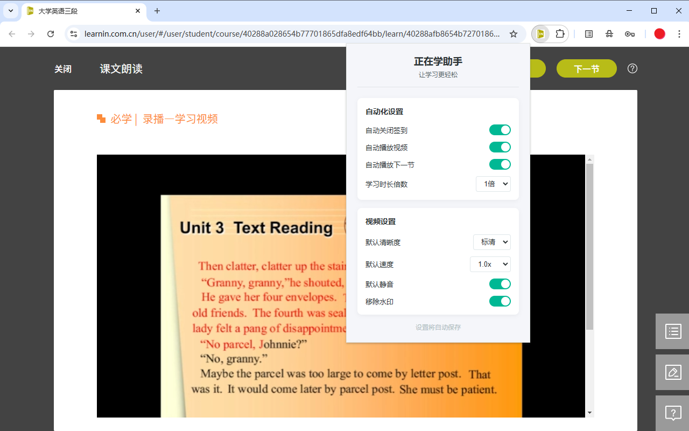

# 正在学助手

一个帮助优化正在学平台学习体验的 Chrome 扩展。

## 主要功能

### 自动化功能
- 自动关闭签到提示框
- 自动播放视频
- 自动跳转下一节课程
- 自定义学习时长倍数
- 自动移除视频水印

### 视频设置
- 自定义默认视频清晰度（高清/标清）
- 自定义默认播放速度（0.5x - 2x）
- 默认静音播放

## 使用方法

1. 在 Chrome 浏览器中安装此扩展
2. 点击扩展图标，进行相关设置
3. 打开正在学页面，扩展会根据您的设置自动运行

## 设置说明

- **自动关闭签到**: 自动关闭课程中弹出的签到提示框
- **默认清晰度**: 设置视频默认播放的清晰度
- **默认速度**: 设置视频默认的播放速度
- **自动播放**: 自动开始播放视频
- **自动下一节**: 当前视频学习完成后自动跳转至下一节课程
- **学习时长倍数**: 设置达到目标学习时长的倍数后自动跳转（1-5倍）
- **移除水印**: 移除视频播放时的水印
- **默认静音**: 视频默认以静音模式播放

## 注意事项

- 本扩展仅用于提升学习体验，请勿用于其他用途
- 使用时请确保网络连接稳定
- 建议根据实际需求开启相应功能

## 隐私说明

本扩展不会收集任何个人信息，所有设置数据仅保存在本地浏览器中。 